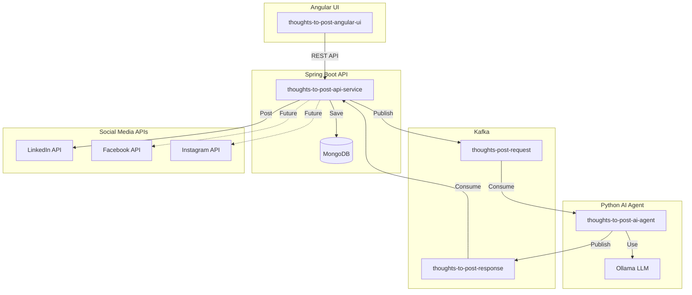

# Thoughts-to-Post AI Agent Platform - Implementation Plan

This plan outlines the implementation of a modular social media posting platform that transforms user thoughts/topics into enriched content using AI, generates relevant images, and posts to selected social media platforms (LinkedIn initially, with extensibility for Facebook and Instagram).

## Architecture Overview



---

## User Review Required

> [!IMPORTANT]
> **Configuration Items You'll Need to Provide:**
> 1. **MongoDB** - Connection URI, database name, credentials
> 2. **Kafka** - Bootstrap servers, topic configuration
> 3. **LinkedIn API** - OAuth 2.0 credentials (Client ID, Client Secret)
> 4. **Ollama** - Local installation with models (recommended: `llama3.2` for text, `llava` for image analysis)
> 5. **Image Generation** - Stable Diffusion or DALL-E API key (or local Stable Diffusion)

> [!WARNING]
> **Prerequisites to Install Before Running:**
> - Node.js 18+ and npm
> - Java 21+ and Maven
> - Python 3.11+ and Poetry
> - MongoDB (local or Atlas)
> - Apache Kafka (local or cloud)
> - Ollama with models downloaded

---

## Proposed Changes

### Component 1: Python AI Agent (`thoughts-to-post-ai-agent`)

#### [NEW] [pyproject.toml](file:///c:/Users/SAKTHIVADIVEL/Documents/git/carlev-106/carlev-thoughts-to-post-ai-agent/thoughts-to-post-ai-agent/pyproject.toml)
Python project configuration with Poetry, defining dependencies: langchain, langchain-ollama, langgraph, kafka-python, pydantic.

#### [NEW] [src/\_\_init\_\_.py](file:///c:/Users/SAKTHIVADIVEL/Documents/git/carlev-106/carlev-thoughts-to-post-ai-agent/thoughts-to-post-ai-agent/src/__init__.py)
Package initialization.

#### [NEW] [src/models/dataclasses.py](file:///c:/Users/SAKTHIVADIVEL/Documents/git/carlev-106/carlev-thoughts-to-post-ai-agent/thoughts-to-post-ai-agent/src/models/dataclasses.py)
Python dataclasses for:
- `ThoughtRequest` - Input from Kafka (thought, platforms, userId)
- `EnrichedContent` - AI-generated content with title, body, hashtags
- `GeneratedImage` - Base64 encoded image with metadata
- `AgentContext` - Full context with original and enriched content history
- `AgentResponse` - Response to send back via Kafka

#### [NEW] [src/agents/content_enrichment_agent.py](file:///c:/Users/SAKTHIVADIVEL/Documents/git/carlev-106/carlev-thoughts-to-post-ai-agent/thoughts-to-post-ai-agent/src/agents/content_enrichment_agent.py)
LangChain agent for content enrichment:
- System prompt for professional social media content generation
- Multi-step chain: understand → expand → polish → format for platform
- Uses `langchain_ollama.ChatOllama` with llama3.2 model
- Returns platform-specific formatted content

#### [NEW] [src/agents/image_generation_agent.py](file:///c:/Users/SAKTHIVADIVEL/Documents/git/carlev-106/carlev-thoughts-to-post-ai-agent/thoughts-to-post-ai-agent/src/agents/image_generation_agent.py)
Agent for image generation:
- Generates image prompts based on enriched content
- Interfaces with Stable Diffusion API (configurable)
- Returns base64 encoded images

#### [NEW] [src/memory/checkpoint.py](file:///c:/Users/SAKTHIVADIVEL/Documents/git/carlev-106/carlev-thoughts-to-post-ai-agent/thoughts-to-post-ai-agent/src/memory/checkpoint.py)
LangGraph checkpoint memory implementation:
- Stores conversation history per request ID
- Tracks original thought → enriched content → refinements
- Uses `MemorySaver` from langgraph for persistence

#### [NEW] [src/kafka/consumer.py](file:///c:/Users/SAKTHIVADIVEL/Documents/git/carlev-106/carlev-thoughts-to-post-ai-agent/thoughts-to-post-ai-agent/src/kafka/consumer.py)
Kafka consumer for `thoughts-post-request` topic.

#### [NEW] [src/kafka/producer.py](file:///c:/Users/SAKTHIVADIVEL/Documents/git/carlev-106/carlev-thoughts-to-post-ai-agent/thoughts-to-post-ai-agent/src/kafka/producer.py)
Kafka producer for `thoughts-to-post-response` topic.

#### [NEW] [src/config.py](file:///c:/Users/SAKTHIVADIVEL/Documents/git/carlev-106/carlev-thoughts-to-post-ai-agent/thoughts-to-post-ai-agent/src/config.py)
Configuration management using pydantic-settings with environment variables.

#### [NEW] [src/main.py](file:///c:/Users/SAKTHIVADIVEL/Documents/git/carlev-106/carlev-thoughts-to-post-ai-agent/thoughts-to-post-ai-agent/src/main.py)
Main entry point that orchestrates Kafka consumption, agent processing, and response publishing.

#### [NEW] [.env.example](file:///c:/Users/SAKTHIVADIVEL/Documents/git/carlev-106/carlev-thoughts-to-post-ai-agent/thoughts-to-post-ai-agent/.env.example)
Example environment file with all required configuration variables.

---

### Component 2: Spring Boot API Service (`thoughts-to-post-api-service`)

#### [NEW] [pom.xml](file:///c:/Users/SAKTHIVADIVEL/Documents/git/carlev-106/carlev-thoughts-to-post-ai-agent/thoughts-to-post-api-service/pom.xml)
Maven configuration with dependencies:
- Spring Boot 3.2+
- Spring Data MongoDB
- Spring Kafka
- Spring Web
- Lombok
- Spring Security (for OAuth)

#### [NEW] [src/main/resources/application.yml](file:///c:/Users/SAKTHIVADIVEL/Documents/git/carlev-106/carlev-thoughts-to-post-ai-agent/thoughts-to-post-api-service/src/main/resources/application.yml)
Application configuration for MongoDB, Kafka, and social media API settings.

#### [NEW] [src/main/java/.../model/ThoughtsToPost.java](file:///c:/Users/SAKTHIVADIVEL/Documents/git/carlev-106/carlev-thoughts-to-post-ai-agent/thoughts-to-post-api-service/src/main/java/com/carlev/thoughtstopost/model/ThoughtsToPost.java)
MongoDB document entity:
- `id`, `userId`, `originalThought`, `enrichedContent`, `generatedImageUrl`
- `selectedPlatforms` (List<String>), `status`, `version`
- `createdAt`, `updatedAt`, `createdBy`, `updatedBy`

#### [NEW] [src/main/java/.../model/ThoughtsToPostHistory.java](file:///c:/Users/SAKTHIVADIVEL/Documents/git/carlev-106/carlev-thoughts-to-post-ai-agent/thoughts-to-post-api-service/src/main/java/com/carlev/thoughtstopost/model/ThoughtsToPostHistory.java)
Audit history document:
- Reference to main document, version snapshot
- All field values at that version, action type (CREATE/UPDATE/DELETE)

#### [NEW] [src/main/java/.../repository/ThoughtsToPostRepository.java](file:///c:/Users/SAKTHIVADIVEL/Documents/git/carlev-106/carlev-thoughts-to-post-ai-agent/thoughts-to-post-api-service/src/main/java/com/carlev/thoughtstopost/repository/ThoughtsToPostRepository.java)
Spring Data MongoDB repository interface.

#### [NEW] [src/main/java/.../repository/ThoughtsToPostHistoryRepository.java](file:///c:/Users/SAKTHIVADIVEL/Documents/git/carlev-106/carlev-thoughts-to-post-ai-agent/thoughts-to-post-api-service/src/main/java/com/carlev/thoughtstopost/repository/ThoughtsToPostHistoryRepository.java)
Repository for audit history.

#### [NEW] [src/main/java/.../service/ThoughtsService.java](file:///c:/Users/SAKTHIVADIVEL/Documents/git/carlev-106/carlev-thoughts-to-post-ai-agent/thoughts-to-post-api-service/src/main/java/com/carlev/thoughtstopost/service/ThoughtsService.java)
Business logic:
- Create thought requests, publish to Kafka
- Handle responses from AI agent
- Version increment and history logging

#### [NEW] [src/main/java/.../kafka/ThoughtsKafkaProducer.java](file:///c:/Users/SAKTHIVADIVEL/Documents/git/carlev-106/carlev-thoughts-to-post-ai-agent/thoughts-to-post-api-service/src/main/java/com/carlev/thoughtstopost/kafka/ThoughtsKafkaProducer.java)
Kafka producer for `thoughts-post-request` topic.

#### [NEW] [src/main/java/.../kafka/ThoughtsKafkaConsumer.java](file:///c:/Users/SAKTHIVADIVEL/Documents/git/carlev-106/carlev-thoughts-to-post-ai-agent/thoughts-to-post-api-service/src/main/java/com/carlev/thoughtstopost/kafka/ThoughtsKafkaConsumer.java)
Kafka consumer for `thoughts-to-post-response` topic.

#### [NEW] [src/main/java/.../controller/ThoughtsController.java](file:///c:/Users/SAKTHIVADIVEL/Documents/git/carlev-106/carlev-thoughts-to-post-ai-agent/thoughts-to-post-api-service/src/main/java/com/carlev/thoughtstopost/controller/ThoughtsController.java)
REST API endpoints:
- `POST /api/thoughts` - Submit new thought
- `GET /api/thoughts/{id}` - Get thought status
- `POST /api/thoughts/{id}/approve` - Approve and post
- `GET /api/thoughts/history/{id}` - Get version history

#### [NEW] [src/main/java/.../social/SocialMediaService.java](file:///c:/Users/SAKTHIVADIVEL/Documents/git/carlev-106/carlev-thoughts-to-post-ai-agent/thoughts-to-post-api-service/src/main/java/com/carlev/thoughtstopost/social/SocialMediaService.java)
Interface for social media posting abstraction.

#### [NEW] [src/main/java/.../social/LinkedInService.java](file:///c:/Users/SAKTHIVADIVEL/Documents/git/carlev-106/carlev-thoughts-to-post-ai-agent/thoughts-to-post-api-service/src/main/java/com/carlev/thoughtstopost/social/LinkedInService.java)
LinkedIn API v2 integration with OAuth 2.0.

---

### Component 3: Angular UI (`thoughts-to-post-angular-ui`)

#### [NEW] Angular Project Initialization
Initialize using `ng new` with Angular 18+, standalone components, SCSS.

#### [NEW] [src/app/app.component.ts](file:///c:/Users/SAKTHIVADIVEL/Documents/git/carlev-106/carlev-thoughts-to-post-ai-agent/thoughts-to-post-angular-ui/src/app/app.component.ts)
Root component with routing.

#### [NEW] [src/app/components/thought-input/](file:///c:/Users/SAKTHIVADIVEL/Documents/git/carlev-106/carlev-thoughts-to-post-ai-agent/thoughts-to-post-angular-ui/src/app/components/thought-input/)
Component for:
- Topic/thought input textarea
- Social media platform checkboxes (LinkedIn, Facebook*, Instagram*)
- Submit button

#### [NEW] [src/app/components/enriched-content/](file:///c:/Users/SAKTHIVADIVEL/Documents/git/carlev-106/carlev-thoughts-to-post-ai-agent/thoughts-to-post-angular-ui/src/app/components/enriched-content/)
Component for:
- Display AI-enriched content
- Show generated image
- Approve/Reject/Request Enhancement buttons

#### [NEW] [src/app/components/post-status/](file:///c:/Users/SAKTHIVADIVEL/Documents/git/carlev-106/carlev-thoughts-to-post-ai-agent/thoughts-to-post-angular-ui/src/app/components/post-status/)
Component for showing posting status and history.

#### [NEW] [src/app/services/thoughts.service.ts](file:///c:/Users/SAKTHIVADIVEL/Documents/git/carlev-106/carlev-thoughts-to-post-ai-agent/thoughts-to-post-angular-ui/src/app/services/thoughts.service.ts)
HTTP service to communicate with Spring Boot API.

#### [NEW] [src/app/models/](file:///c:/Users/SAKTHIVADIVEL/Documents/git/carlev-106/carlev-thoughts-to-post-ai-agent/thoughts-to-post-angular-ui/src/app/models/)
TypeScript interfaces matching API DTOs.

#### [NEW] [src/styles.scss](file:///c:/Users/SAKTHIVADIVEL/Documents/git/carlev-106/carlev-thoughts-to-post-ai-agent/thoughts-to-post-angular-ui/src/styles.scss)
Global styles with modern design system.

---

### Component 4: Development Infrastructure

#### [NEW] [docker-compose.yml](file:///c:/Users/SAKTHIVADIVEL/Documents/git/carlev-106/carlev-thoughts-to-post-ai-agent/docker-compose.yml)
Docker Compose for local development:
- MongoDB container
- Kafka + Zookeeper containers
- (Optional) Ollama container

---

## Verification Plan

### Automated Tests

#### Python AI Agent
```bash
# From thoughts-to-post-ai-agent directory
cd thoughts-to-post-ai-agent
poetry install
poetry run pytest tests/ -v
```

#### Spring Boot API
```bash
# From thoughts-to-post-api-service directory
cd thoughts-to-post-api-service
mvn test
```

#### Angular UI
```bash
# From thoughts-to-post-angular-ui directory
cd thoughts-to-post-angular-ui
npm test
```

### Integration Testing

1. **Start infrastructure:**
   ```bash
   docker-compose up -d
   ```

2. **Start AI Agent:**
   ```bash
   cd thoughts-to-post-ai-agent
   poetry run python src/main.py
   ```

3. **Start Spring Boot API:**
   ```bash
   cd thoughts-to-post-api-service
   mvn spring-boot:run
   ```

4. **Start Angular UI:**
   ```bash
   cd thoughts-to-post-angular-ui
   npm start
   ```

5. **Test flow:** Open browser at `http://localhost:4200`, submit a thought, verify enriched content appears.

### Manual Verification

After all services are running:
1. Open `http://localhost:4200` in browser
2. Enter a sample thought/topic (e.g., "AI in healthcare")
3. Check the LinkedIn platform checkbox
4. Click Submit
5. Wait for enriched content and image to appear
6. Click Approve
7. Verify post appears on LinkedIn (requires valid OAuth credentials)

---

## TODO Items for User (Post-Implementation)

### Immediate Configuration Required
| Item | Description | File Location |
|------|-------------|---------------|
| MongoDB URI | Connection string | `api-service/application.yml` |
| Kafka Servers | Bootstrap servers | Both services' config |
| LinkedIn OAuth | Client ID & Secret | `api-service/application.yml` |
| Ollama Models | Download llama3.2 | Run `ollama pull llama3.2` |

### Infrastructure Setup
- [ ] Install & start MongoDB (or use MongoDB Atlas)
- [ ] Install & start Apache Kafka
- [ ] Install Ollama and pull required models
- [ ] Create Kafka topics: `thoughts-post-request`, `thoughts-to-post-response`

### Social Media Setup
- [ ] Create LinkedIn Developer App
- [ ] Configure OAuth 2.0 callback URL
- [ ] Complete LinkedIn verification process
- [ ] (Future) Facebook App setup
- [ ] (Future) Instagram Basic Display API setup

### Image Generation Setup
- [ ] Option A: Install ComfyUI/Automatic1111 for local Stable Diffusion
- [ ] Option B: Configure OpenAI DALL-E API key
- [ ] Option C: Use Ollama with multimodal model

---

## Implementation Order

1. **Docker Compose** - Set up local development infrastructure
2. **Python AI Agent** - Core AI functionality 
3. **Spring Boot API** - Backend with Kafka integration
4. **Angular UI** - Frontend interface
5. **Integration Testing** - End-to-end verification
