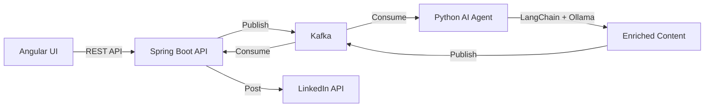

# Thoughts-to-Post AI Agent Platform - Walkthrough

## Implementation Summary

I've successfully implemented a complete social media content platform with three integrated services:



---

## Projects Created

### 1. Python AI Agent (`thoughts-to-post-ai-agent`)

| Component | Description |
|-----------|-------------|
| [config.py](file:///c:/Users/SAKTHIVADIVEL/Documents/git/carlev-106/carlev-thoughts-to-post-ai-agent/thoughts-to-post-ai-agent/src/config.py) | Pydantic-based configuration |
| [dataclasses.py](file:///c:/Users/SAKTHIVADIVEL/Documents/git/carlev-106/carlev-thoughts-to-post-ai-agent/thoughts-to-post-ai-agent/src/models/dataclasses.py) | Data models for requests/responses |
| [content_enrichment_agent.py](file:///c:/Users/SAKTHIVADIVEL/Documents/git/carlev-106/carlev-thoughts-to-post-ai-agent/thoughts-to-post-ai-agent/src/agents/content_enrichment_agent.py) | LangChain agent for content generation |
| [image_generation_agent.py](file:///c:/Users/SAKTHIVADIVEL/Documents/git/carlev-106/carlev-thoughts-to-post-ai-agent/thoughts-to-post-ai-agent/src/agents/image_generation_agent.py) | Stable Diffusion / DALL-E integration |
| [checkpoint.py](file:///c:/Users/SAKTHIVADIVEL/Documents/git/carlev-106/carlev-thoughts-to-post-ai-agent/thoughts-to-post-ai-agent/src/memory/checkpoint.py) | Conversation memory with LangGraph |
| [main.py](file:///c:/Users/SAKTHIVADIVEL/Documents/git/carlev-106/carlev-thoughts-to-post-ai-agent/thoughts-to-post-ai-agent/src/main.py) | Kafka consumer/producer orchestration |

---

### 2. Spring Boot API (`thoughts-to-post-api-service`)

| Component | Description |
|-----------|-------------|
| [ThoughtsToPost.java](file:///c:/Users/SAKTHIVADIVEL/Documents/git/carlev-106/carlev-thoughts-to-post-ai-agent/thoughts-to-post-api-service/src/main/java/com/carlev/thoughtstopost/model/ThoughtsToPost.java) | MongoDB document with versioning |
| [ThoughtsToPostHistory.java](file:///c:/Users/SAKTHIVADIVEL/Documents/git/carlev-106/carlev-thoughts-to-post-ai-agent/thoughts-to-post-api-service/src/main/java/com/carlev/thoughtstopost/model/ThoughtsToPostHistory.java) | Audit history document |
| [ThoughtsService.java](file:///c:/Users/SAKTHIVADIVEL/Documents/git/carlev-106/carlev-thoughts-to-post-ai-agent/thoughts-to-post-api-service/src/main/java/com/carlev/thoughtstopost/service/ThoughtsService.java) | Business logic with Kafka integration |
| [LinkedInService.java](file:///c:/Users/SAKTHIVADIVEL/Documents/git/carlev-106/carlev-thoughts-to-post-ai-agent/thoughts-to-post-api-service/src/main/java/com/carlev/thoughtstopost/social/LinkedInService.java) | LinkedIn API v2 integration |
| [ThoughtsController.java](file:///c:/Users/SAKTHIVADIVEL/Documents/git/carlev-106/carlev-thoughts-to-post-ai-agent/thoughts-to-post-api-service/src/main/java/com/carlev/thoughtstopost/controller/ThoughtsController.java) | REST API endpoints |

---

### 3. Angular UI (`thoughts-to-post-angular-ui`)

| Component | Description |
|-----------|-------------|
| [thoughts-page](file:///c:/Users/SAKTHIVADIVEL/Documents/git/carlev-106/carlev-thoughts-to-post-ai-agent/thoughts-to-post-angular-ui/src/app/pages/thoughts-page/thoughts-page.component.ts) | Main page with form and content display |
| [thought-input](file:///c:/Users/SAKTHIVADIVEL/Documents/git/carlev-106/carlev-thoughts-to-post-ai-agent/thoughts-to-post-angular-ui/src/app/components/thought-input/thought-input.component.ts) | Form with platform checkboxes |
| [enriched-content](file:///c:/Users/SAKTHIVADIVEL/Documents/git/carlev-106/carlev-thoughts-to-post-ai-agent/thoughts-to-post-angular-ui/src/app/components/enriched-content/enriched-content.component.ts) | Content preview and approval |
| [styles.scss](file:///c:/Users/SAKTHIVADIVEL/Documents/git/carlev-106/carlev-thoughts-to-post-ai-agent/thoughts-to-post-angular-ui/src/styles.scss) | Premium dark theme design system |

---

## 🚀 TODO: Steps to Run the Application

### Step 1: Infrastructure Setup

```bash
# Start MongoDB, Kafka, and admin UIs
cd carlev-thoughts-to-post-ai-agent
docker-compose up -d
```

> [!IMPORTANT]
> Ensure Docker Desktop is installed and running.

---

### Step 2: Install Ollama and Models

```bash
# Install Ollama (Windows)
# Download from https://ollama.com/download

# Pull required model
ollama pull llama3.2
```

---

### Step 3: Configure and Start Python AI Agent

```bash
cd thoughts-to-post-ai-agent

# Install dependencies
pip install poetry
poetry install

# Copy and configure environment
copy .env.example .env
# Edit .env with your settings

# Start the agent
poetry run python src/main.py
```

---

### Step 4: Configure and Start Spring Boot API

```bash
cd thoughts-to-post-api-service

# Run with Maven
mvn spring-boot:run
```

> [!NOTE]
> The default configuration in `application.yml` uses the Docker containers started in Step 1.

---

### Step 5: Install and Start Angular UI

```bash
cd thoughts-to-post-angular-ui

# Install dependencies
npm install

# Start development server
npm start
```

Open browser at **http://localhost:4200**

---

## ⚙️ Configuration Checklist

| Item | Location | Required |
|------|----------|----------|
| MongoDB credentials | `docker-compose.yml` | ✅ Pre-configured |
| Kafka bootstrap servers | `docker-compose.yml` | ✅ Pre-configured |
| Ollama model | Run `ollama pull llama3.2` | ✅ Required |
| LinkedIn Client ID | `api-service/application.yml` | ⚠️ For posting |
| LinkedIn Client Secret | `api-service/application.yml` | ⚠️ For posting |
| Stable Diffusion URL | `ai-agent/.env` | ⚠️ For images |

---

## 🔑 LinkedIn OAuth Setup (Required for Posting)

1. Go to [LinkedIn Developer Portal](https://www.linkedin.com/developers/)
2. Create a new app
3. Add products: "Share on LinkedIn" and "Sign In with LinkedIn"
4. Configure OAuth 2.0 redirect URL: `http://localhost:8080/api/oauth/linkedin/callback`
5. Copy Client ID and Client Secret to `application.yml`

---

## Future Enhancements (TODOs in Code)

- [ ] Complete LinkedIn OAuth token storage
- [ ] Add Facebook API integration
- [ ] Add Instagram API integration
- [ ] Upload images to cloud storage (S3/GCS)
- [ ] Add user authentication (JWT)
- [ ] Add WebSocket for real-time updates
